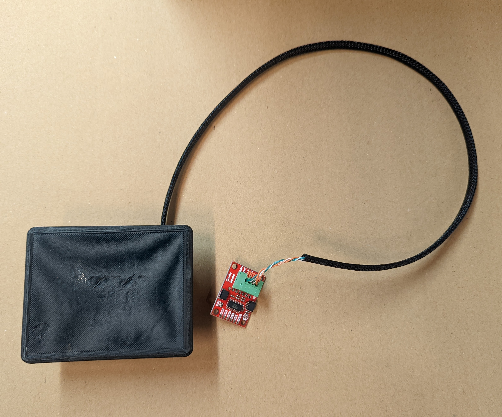
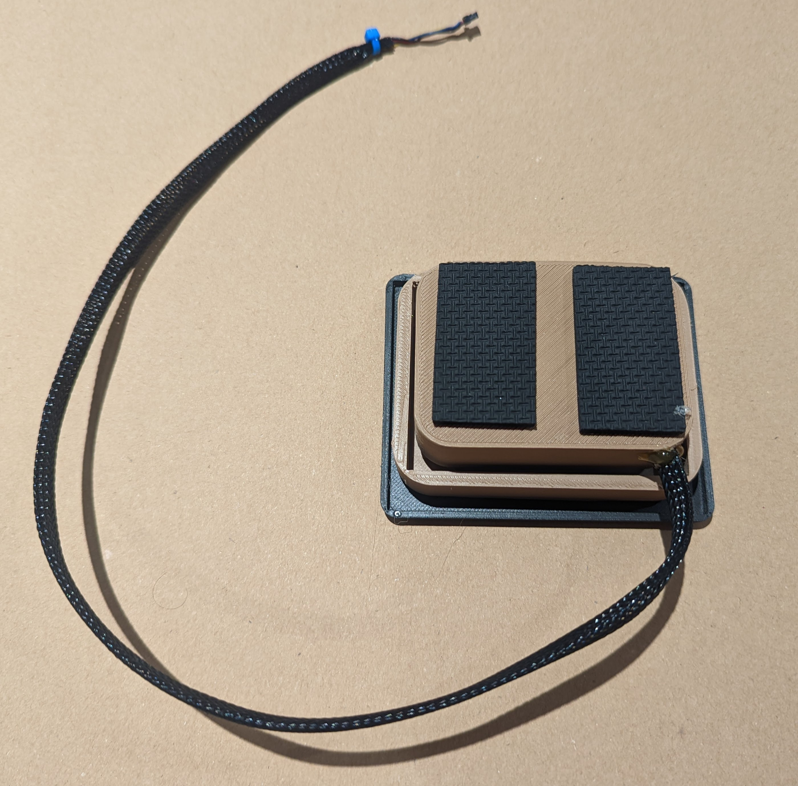
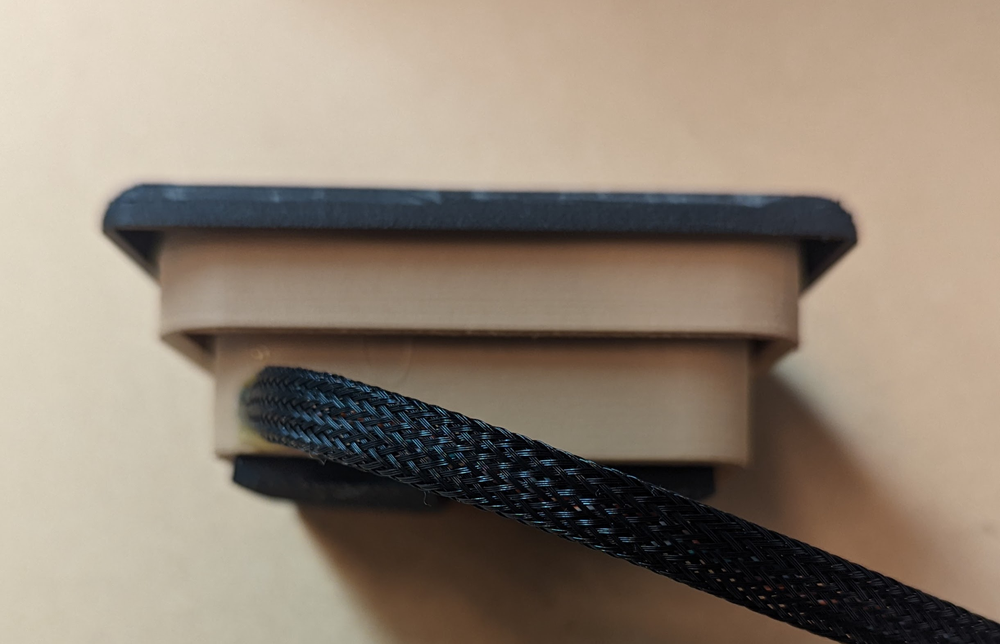

  

# RoboScale - TL;DR

This is a small hobby-scale with a weight capacity of 400g and a resolution of +/- .5 grams.  It is connected through an 18” shielded, twisted-pair RJ-45 cable to a [SparkFun I2C Qwiic Scale breakout board](https://www.sparkfun.com/products/15242).

This is a PERFECT scale for Arduino projects.

The scale is built using an amateur 3D printer, so it has some blemishes, but it still looks cool!

This scale has been calibrated.  So if you put something on it, say, that weighs 50g, the scale will read 50g +/- .5g.

These will be built to order (takes about a day to build). 

## Price is $39.99 

