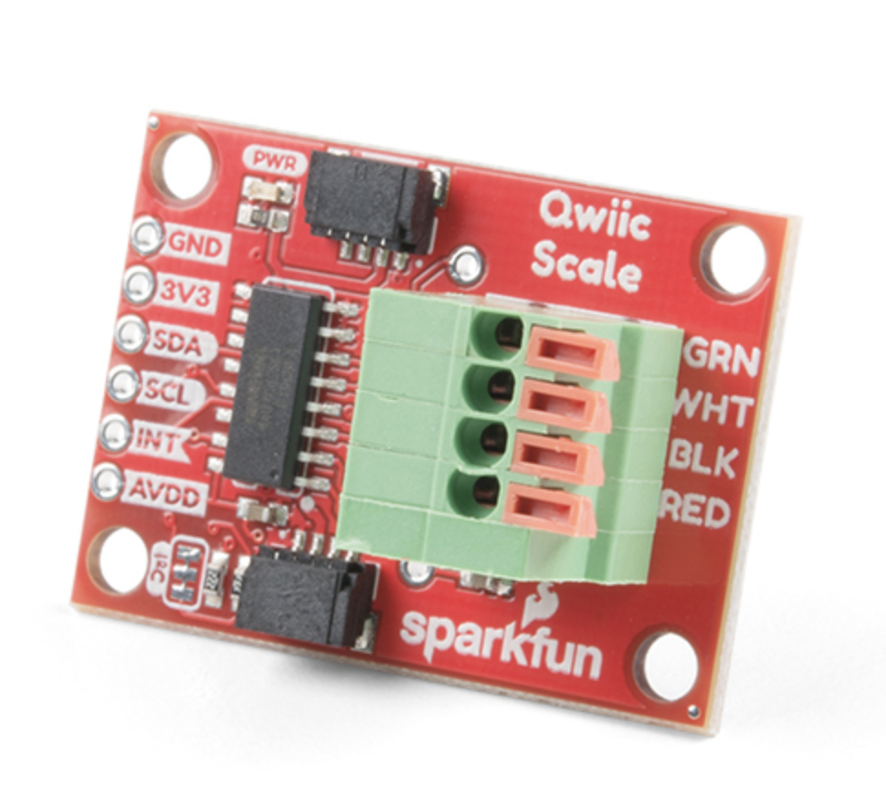

   

# RoboScale - TL;DR

This is a small hobby-scale with a weight capacity of 400g and a resolution of +/- .2 grams.  Internally, this scale has a 500g load cell and a [SparkFun I2C Qwiic Scale breakout board](https://www.sparkfun.com/products/15242).  

The output connector is a [4-pin I2C Qwiic connector](https://www.sparkfun.com/qwiic#:~:text=SparkFun's%20Qwiic%20Connect%20System%20uses,%2C%20LCDs%2C%20relays%20and%20more.). 

This connector is simply 3.3V, GND, SCL, and SDA and can attach to any Arduino board.

This is a PERFECT scale for small projects.  

Approximate dimensions are 3.5" x 3" x 1.5"


## This scale will be custom-built to order (takes about a day to build). 

The scale is built using an amateur 3D printer, so it has some blemishes, but it still looks cool!  Eventually, I might use a professional printing service, but for now, we'll just keep this simple and inexpensive :-)

This scale has been calibrated.  So if you put something on it, say, that weighs 50g, the scale will read 50g +/- .2g. 

I've provided an example [Arduino .INO file](src/roboScale.ino) that demonstrates exactly how to use this scale. Notice the scale factor code:

```
// These values are scale-specific and need to be derived for each scale!
double SCALE_FACTOR = 0.000666;   
double SCALE_OFFSET = 2.91;  
```

These values will be specifically derived for each scale that is custom built. When you receive your scale, you will be given the exact 'SCALE_FACTOR' and 'SCALE_OFFSET' that you need to provide in your Arduino code.

100% money-back satisfaction guarantee.

## Price is $69.99 

(the internal load cell and sparkfun scale board retail together for $27, so this is quite a deal)


# [On sale @ Etsy](https://www.etsy.com/listing/1443511503/arduino-ready-espresso-scale?ref=listings_manager_grid)

# [and on Facebook Marketplace](https://www.facebook.com/marketplace/item/1831684600536976/): 

