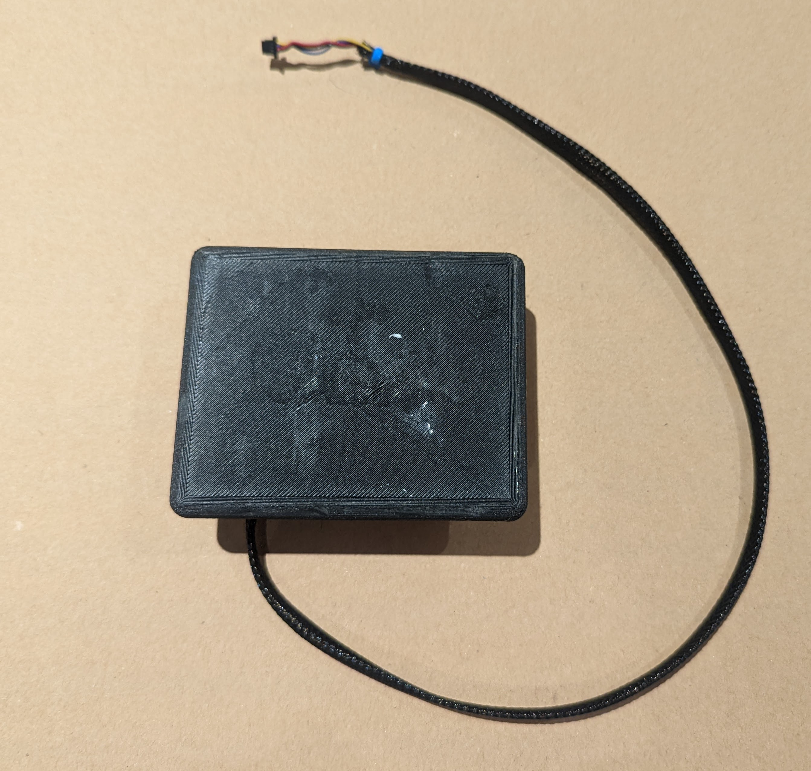

# roboGaggia - TL;DR

This is a small hobby-scale with a weight capacity of 400g and a resolution of +/- .5 grams.  It is connected through an 18” cable to a [SparkFun I2C Qwiic Scale breakout board](https://www.sparkfun.com/products/15242).

This scale has been calibrated

You can visit my [RoboScale](https://github.com/ndipatri/RoboScale) GitHub repository to see how you can integrate RoboScale with your Arduino project.
